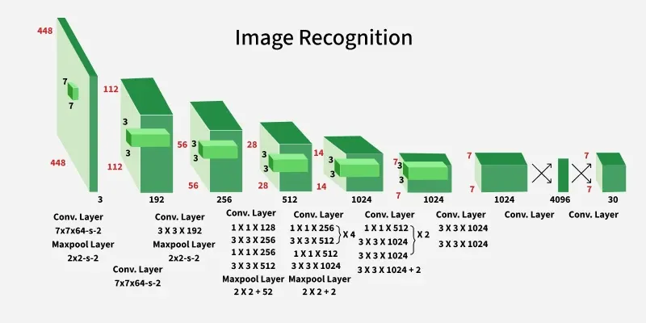

# Computer Vision, Neural Networks & Object Detection Models (YOLO)

This document details computer vision and image processing fundamentals, basics of neural networks and object detection model architecture (YOLO)

## Part 1: Computer Vision Fundamentals

### What is Computer Vision?

Computer Vision (CV) is a field of artificial intelligence that enables computers to understand, interpret, and make decisions based on visual data (images and videos). It mimics how humans see and understand the world.

**Key Tasks in Computer Vision:**
- **Image Classification**: Is this a dog or a cat?
- **Object Detection**: Find and locate all objects in the image
- **Segmentation**: Identify exact pixels belonging to objects
- **Instance Segmentation**: Find each dog separately
- **Pose Estimation**: Detect body position and joints

**Our Project Uses:** Object Detection (finding and locating boats)

### How Computers See Images

**Digital Images as Numbers:**

When you take a photo, it's stored as a grid of pixels. Each pixel has color values:

```
Image (640x640 pixels)
│
├─ Pixel [0,0]: Red=255, Green=120, Blue=45
├─ Pixel [0,1]: Red=200, Green=150, Blue=100
├─ Pixel [0,2]: Red=180, Green=180, Blue=180
...
└─ Pixel [639,639]: Red=50, Green=50, Blue=50

Total Data: 640 × 640 × 3 (RGB channels) = 1,228,800 numbers per image
```

Computers don't "see" images like humans do. They see matrices of numbers. A model must learn to recognize patterns in these numbers that correspond to meaningful objects.

### Why Neural Networks?

Traditional computer vision approaches:
- Write explicit rules (e.g., "if red pixels > threshold, it's a boat")
- Manually craft features (edge detection, color histograms)
- Limited accuracy, inflexible

**Neural Networks:**
- Learn features automatically from data
- Discover patterns humans might miss
- Adapt to different lighting, angles, conditions
- Far more accurate

---

## Part 2: Neural Networks Basics

### What is a Neural Network?

A neural network is inspired by biological neurons in the brain. It's a system of interconnected nodes (artificial neurons) organized in layers.

### Network Architecture


```
Input Layer          Hidden Layers              Output Layer
(Image data)         (Learn patterns)           (Predictions)

Pixel values    →  Detects edges      →  Detects shapes   →  "Boat" or "Not boat"
                   Detects corners        Detects objects      confidence: 0.95
                   Detects textures      
```

### Basic Concepts

**Neurons/Nodes:**
```
Input values (x1, x2, x3, ...)
         ↓
    Weighted sum: z = w1*x1 + w2*x2 + w3*x3 + bias
         ↓
    Activation function (ReLU): if z > 0 then z else 0
         ↓
    Output value
```

**Weights & Biases:**
- **Weights (w)**: How much each input contributes (learned during training)
- **Bias (b)**: Offset or threshold (learned during training)
- Model "learns" by adjusting thousands/millions of weights

**Activation Functions:**
- **ReLU (Rectified Linear Unit)**: Most common, outputs 0 or positive values
- **Sigmoid**: Outputs 0-1 (good for binary decisions)
- **Softmax**: Outputs probabilities across multiple classes

### Training a Neural Network

```
1. Start with random weights
2. Feed image through network → get prediction
3. Compare to ground truth: "This is a boat"
4. Calculate error (how wrong we were)
5. Backpropagation: Calculate how to fix each weight
6. Update weights to reduce error
7. Repeat with thousands of images until accurate
```

**Loss Function:**
- Measures how wrong the model is
- Model tries to minimize loss
- Lower loss = better model

---

## Part 3: Image Processing Techniques

### Preprocessing Images

Before feeding images to neural networks, we prepare them:

**1. Resizing**
```
Original image: 1920 x 1080 pixels
                ↓
            Resize to 640 x 640
                ↓
Reason: Model expects fixed input size, reduces computation
```

**2. Normalization**
```
Raw pixel values: 0-255 (8-bit color)
                ↓
            Divide by 255
                ↓
Normalized values: 0.0-1.0
                ↓
Reason: Helps neural network train faster and more stably
```

**3. Data Augmentation**
```
Original image
    ↓
    ├─ Rotate by 10°
    ├─ Flip horizontally
    ├─ Adjust brightness
    ├─ Add slight noise
    └─ Adjust contrast
    
Each variation is a new training sample
Reason: Prevents overfitting, makes model robust to variations
```

### Feature Extraction

Networks learn to extract increasingly complex features:

```
Layer 1: Edges & Corners
  ├─ Vertical edges
  ├─ Horizontal edges
  └─ Diagonal edges

Layer 2: Simple Shapes
  ├─ Circles
  ├─ Rectangles
  └─ Lines

Layer 3: Object Parts
  ├─ Wheels
  ├─ Windows
  └─ Hulls (for boats)

Layer 4: Complete Objects
  ├─ Boats
  ├─ People
  └─ Dock structures
```

### Bounding Box Representation

Once objects are detected, they're described by coordinates:

```
Image coordinate system:
(0,0)────────────────────(640,0)
  │                          │
  │     Detected boat        │
  │   (100,150) ────────┐    │
  │        │            │    │
  │        │  Box: x1,y1│    │
  │        │  to  x2,y2 │    │
  │        │            │    │
  │        └────────(300,250) │
  │                          │
(0,640)─────────────────(640,640)

Coordinates:
- x1, y1: Top-left corner
- x2, y2: Bottom-right corner
- Width: x2 - x1
- Height: y2 - y1
```

---

## Part 4: YOLOv8 Architecture

### What is YOLO?

**YOLO = You Only Look Once**

Traditional object detection:
1. Generate thousands of candidate boxes
2. Classify each candidate
3. Post-process results
Slow, many redundant calculations

**YOLO Innovation:**
- Single forward pass through network
- Predicts all objects in one step
- Much faster (real-time capable)
- End-to-end trainable

### YOLOv8 Overview

YOLO version 8 introduces improvements:
- More accurate than v7
- Better small object detection
- Faster inference
- Better mobile/edge device support

### YOLOv8 Architecture Diagram



```
Input Image (640×640×3)
    ↓
┌────────────────────────────────────────┐
│        Backbone Network (CSPDarknet)   │
│                                        │
│  Extract features at multiple scales   │
│  ├─ Layer 1: 640×640 resolution        │
│  ├─ Layer 2: 320×320 resolution        │
│  ├─ Layer 3: 160×160 resolution        │
│  └─ Layer 4: 80×80 resolution          │
└────────────────────────────────────────┘
    ↓
┌────────────────────────────────────────┐
│         Neck Network (PANet)           │
│                                        │
│  Combine features from different       │
│  scales (feature fusion)               │
│  ├─ Top-down pathway                   │
│  └─ Bottom-up pathway                  │
└────────────────────────────────────────┘
    ↓
┌────────────────────────────────────────┐
│           Head Network (Decoder)       │
│                                        │
│  Three prediction scales:              │
│  ├─ 80×80 grid: Small objects          │
│  ├─ 40×40 grid: Medium objects         │
│  └─ 20×20 grid: Large objects          │
│                                        │
│  For each grid cell, predict:          │
│  ├─ Objectness: Is there object? (0-1) │
│  ├─ Bounding box: x,y,w,h coordinates  │
│  └─ Class probabilities: [in/out]      │
└────────────────────────────────────────┘
    ↓
Post-processing:
├─ Filter by confidence threshold (0.5)
├─ NMS (Non-Maximum Suppression)
└─ Return final detections
```

### Key Components

**1. Backbone (CSPDarknet)**
- Extracts initial features from image
- Multiple convolutional layers
- Reduces spatial dimensions, increases feature complexity
- Output: High-level feature maps

**2. Neck (PANet - Path Aggregation Network)**
- Combines features from different scales
- Small objects need detailed low-level features
- Large objects benefit from semantic high-level features
- Fuses information bidirectionally (top-down + bottom-up)

**3. Head (Detection Decoder)**
- Generates predictions
- Creates grids at different resolutions
- Each cell predicts possible objects
- Outputs: boxes, confidence, class probabilities

### Detection Process

**Grid-Based Prediction:**

```
Image divided into 20×20 grid (for large object scale)

Each grid cell predicts:
┌────────────────────────┐
│  Objectness: 0.95      │  ← Confidence that object exists
│  Box: [x,y,w,h]        │  ← Position and size
│  Classes: [0.05, 0.92] │ ← [P(In), P(Out)]
└────────────────────────┘

Grid cells with objectness > 0.5: Likely has object
Grid cells with objectness < 0.5: Likely background
```

### Non-Maximum Suppression (NMS)

Problem: Multiple overlapping predictions for same object

```
Input: Multiple predictions
  ├─ Box 1: [100,100,200,200] confidence 0.95
  ├─ Box 2: [110,110,210,210] confidence 0.85
  ├─ Box 3: [90,90,190,190]   confidence 0.70
  └─ Box 4: [300,300,400,400] confidence 0.92

Process:
1. Sort by confidence (highest first)
2. Keep highest: Box 1 (0.95)
3. Calculate Intersection over Union (IoU) with others:
   - IoU(1,2) = 0.85 > threshold (0.5) → Remove Box 2
   - IoU(1,3) = 0.75 > threshold (0.5) → Remove Box 3
   - IoU(1,4) = 0.00 < threshold (0.5) → Keep Box 4
4. Keep next highest: Box 4 (0.92)

Output: Final predictions
  ├─ Box 1: [100,100,200,200] confidence 0.95
  └─ Box 4: [300,300,400,400] confidence 0.92
```

### Our Implementation

**Fine-tuned YOLOv8n (Nano)**
- n = Nano (smallest, fastest variant)
- **Trained on:** Chokepoint fishing data and finetuned with lesser epochs and smaller batch size
- **Classes:** [0: "in", 1: "out"]
- **Confidence threshold:** 0.5 (prioritizes recall)
- **Fallback:** yolov8n.pt (pretrained on general objects)

**Advantages:**
- Fast inference (real-time)
- Lightweight (< 7 MB)
- Accurate for our specific use case
- Can run on CPU

---

## Part 5: Roboflow Fishing Model (Detection)

### What is Roboflow?

Roboflow is a platform that:
- Hosts pre-trained computer vision models
- Provides API for inference
- Handles model deployment and versioning
- Offers dataset management and annotation tools

### Fishing-Access-Points Model

**Model Details:**
- **Name:** fishing-access-points/2
- **Version:** 2 (improved iteration)
- **Architecture:** YOLOv26 or similar (hosted on Roboflow)
- **Training Data:** Images of boats at fishing access points
- **Classes:** Primarily "boat" detection
- **Confidence threshold (ours):** 0.7

### API-Based Inference

Unlike local YOLOv8 (code running on your machine), Roboflow is cloud-based:

```
Your Image (640×640 JPEG)
    ↓
HTTP POST to: https://detect.roboflow.com
    ├─ API key: Authentication
    ├─ Model ID: fishing-access-points/2
    └─ Image data: Base64 encoded
    ↓
Roboflow Server
├─ Model loaded in GPU memory
├─ Process image
├─ Run inference
└─ Return predictions
    ↓
JSON Response:
{
  "predictions": [
    {
      "x": 150,
      "y": 200,
      "width": 100,
      "height": 80,
      "confidence": 0.92,
      "class": "boat"
    }
  ]
}
    ↓
Parse response in your code
Extract coordinates, confidence
Return results
```


### Our Implementation

**Lazy Loading:**
```python
# First call: Create client, connect to API
client = InferenceHTTPClient(
    api_url="https://detect.roboflow.com",
    api_key="M3JrGmzqiCkeQlz3CFYJ"
)

# Subsequent calls: Reuse existing client
result = client.infer(image_path, model_id="fishing-access-points/2")
```

**Prediction Parsing:**
```python
# API returns predictions in center-point format
for pred in result["predictions"]:
    x, y = pred["x"], pred["y"]          # Center
    w, h = pred["width"], pred["height"]  # Size
    conf = pred["confidence"]
    
    # Convert to corner format for annotation
    x1 = x - w/2
    y1 = y - h/2
    x2 = x + w/2
    y2 = y + h/2
```

---

## Part 6: Comparison & Model Selection

### How is a model picked?

The data is used to train both architectures and the model with the closest values of precision, recall and mAP50 to the definition of success is picked. For the chokepoint model, the manually-trained YOLOv8 model had better precision and recall while the roboflow model performed better for the fishing point model.

### Why Two Models?

**Chokepoint Model:**
- Specific use case: boats entering/exiting
- Binary classification (in/out) requires fine-tuning
- Local inference for instant feedback
- Custom dataset essential

**Fishing Model:**
- General boat detection
- Pre-trained on relevant domain
- API simplifies deployment
- Handles variations in boat types and environments


---

## Part 7: Training & Transfer Learning

### How Models Are Trained

**General Training Process:**

```
1. Dataset Collection
   └─ Thousands of labeled images
      ├─ Image of boat + Annotation: bounding box + "in"/"out"
      └─ Image of water + Annotation: no objects

2. Preprocessing
   └─ Resize, normalize, augment images

3. Model Initialization
   └─ YOLOv8 with random weights

4. Training Loop (repeated 100+ epochs)
   ├─ Feed batch of images
   ├─ Forward pass: Get predictions
   ├─ Calculate loss: How wrong we are
   ├─ Backward pass: Calculate gradients
   └─ Update weights: Reduce loss

5. Validation
   └─ Test on unseen data to prevent overfitting

6. Final Model
   └─ Save weights for inference
```

### Transfer Learning

Our chokepoint model uses transfer learning:

```
Pretrained YOLOv8
(trained on 1M general images)
       ↓
   Backbone: Knows how to detect edges,
             shapes, objects in general
       ↓
Remove head, add new classification layers
       ↓
Fine-tune on chokepoint data
(trained on 1k+ fishing images)
       ↓
Final model: Combines general knowledge
            + specific fishing expertise
```

**Benefits:**
- Faster training (weeks → hours)
- Better with limited data
- Higher accuracy with less data
- Reduced computational cost

---

## Part 8: Real-World Considerations

### Confidence Thresholds

**Threshold Trade-off:**

```
High threshold (0.9):
├─ Very confident predictions
├─ Fewer false positives (wrong detections)
└─ BUT: Misses some real boats (false negatives)
   Precision ↑, Recall ↓

Low threshold (0.3):
├─ More detections
├─ Catches almost all boats
└─ BUT: Many wrong detections (false positives)
   Precision ↓, Recall ↑

Our choices:
├─ Chokepoint: 0.5 (balance, slightly favor recall)
└─ Fishing: 0.7 (higher bar, fewer false positives)
```

### Handling Variations

Neural networks must handle:

```
Different Conditions:
├─ Time of day: Sunrise, noon, sunset
├─ Weather: Clear, cloudy, rain, fog
├─ Water state: Calm, rough, waves
├─ Boat types: Fishing boats, kayaks, motorboats
├─ Angles: Frontal, side, angled
├─ Distances: Close, far away, partially visible
└─ Lighting: Bright sun, shadows, reflections

Solution: Training data must include variety
├─ Diverse locations
├─ Multiple seasons
├─ Various weather conditions
├─ Different times of day
```

### Edge Cases & Limitations

**Model might struggle with:**
- Boats partially outside frame
- Extreme lighting conditions
- Boat reflections in water
- Small boats far away
- Boats covered/obscured by objects

**Mitigation:**
- Pre-process images (enhance contrast)
- Combine with other detection methods
- Human review of low-confidence predictions
- Continuous retraining with new data

---